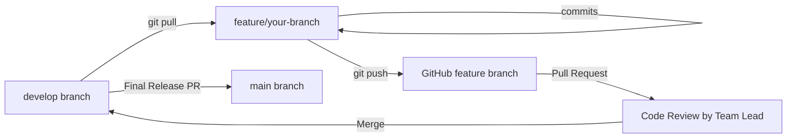

# 🌉 ConceptBridge AI

> **Tagline:** *From "I don't understand" to "Oh, it's that easy!"*

---

## 📖 1. Project Description

**ConceptBridge AI** is an AI-powered personalized learning companion designed to help learners conquer complex academic and technical topics. Instead of overwhelming students with dense academic jargon, ConceptBridge AI bridges the gap between everyday experience and technical mastery by teaching through real-world analogies first, followed by adaptive, multi-tiered explanations tailored to the learner's evolving knowledge state.

ConceptBridge AI actively monitors cognitive fatigue and provides built-in, non-addictive **Smart Refresh** micro-breaks (strictly capped at 5 minutes) that recharge the mind and seamlessly return the student back to their learning checkpoint.

---

## ✨ 2. Main Features

1. **Analogy-First Teaching:** Explains difficult academic and technical concepts using intuitive real-world analogies before diving into technical details.
2. **Multi-Tiered Explanations:**
   - Real-world analogy
   - Simple beginner-friendly summary
   - Technical deep dive
   - Practical examples, interactive code snippets, and visual/ASCII conceptual diagrams
3. **Dynamic Learner Profiling:** Gradually builds and refines the learner's profile across continuous interactions rather than making rigid assumptions from a single prompt.
4. **Adaptive Explanation Engine:** Automatically adjusts tone, depth, and prerequisite coverage based on estimated mastery.
5. **Misconception Detection:** Identifies weak areas, foundational gaps, and cognitive misconceptions from quiz responses and questions.
6. **Targeted Recommendations:** Intelligently recommends what the learner should study next.
7. **Topic Mastery & Progress Tracking:** Visualizes learning milestones and retention analytics.
8. **5-Minute Smart Refresh (Study Break):**
   - Strictly capped at a maximum of 5 minutes (300 seconds) to avoid gaming addiction.
   - Automatically saves learning context and returns the student to their exact study point upon completion.
   - Activities include:
     - 🃏 Technical memory-card games
     - 🔍 Guess-the-concept games with progressive hints
     - 🌍 General knowledge (GK) trivia
     - 🔢 Fun mathematics and pattern puzzles
     - 📚 English and vocabulary anagrams
     - 👅 Tongue twisters for articulation and stress relief
     - 🧩 Mind-bending riddles
     - 🧘 Guided micro-relaxation (20-20-20 eye rest & 4-7-8 breathing)
     - 💬 Friendly AI break conversation

---

## 👥 3. Team Roles & Responsibilities

The project is developed collaboratively by a 4-member hackathon team:

| Member | Role | Key Skills | Core Responsibilities | Assigned Branch |
| :--- | :--- | :--- | :--- | :--- |
| **Member 1** | **Team Lead / AI & ML** | Python, AI/ML, Basic Java | AI teaching engine, learner profiling, knowledge/mastery estimation, misconception detection, personalized recommendations, AI integration, overall architecture & final integration | `feature/ai-teaching` |
| **Member 2** | **UI/UX** | Frontend, Streamlit, UI/UX | Login/onboarding, learning interface, chat interface, concept explanation cards, feedback controls, student dashboard, Smart Refresh UI, games UI | `feature/ui` |
| **Member 3** | **Database** | SQL, Database Design, Python | Database schema, users, learner profiles, topics, learning history, questions, attempts, topic mastery, feedback, Smart Refresh history | `feature/database` |
| **Member 4** | **AI/ML + Smart Refresh** | Python, AI/ML, Gamification | Fatigue & learning-state signal detection, Smart Refresh engine, 5-minute timer logic, memory games, riddles, GK, math, English, tongue twisters, relaxation, friendly chat | `feature/smart-refresh` |

---

## 💻 4. Collaborative Development Across 4 Laptops

This project is built collaboratively by 4 engineers working concurrently on their individual machines:
- **Zero Conflict Strategy:** Strict modular separation ensures each member has isolated file ownership.
- **Branch Isolation:** No team member develops directly on `main` or `develop`.
- **Interface Contracts:** Subsystems communicate through clean function contracts (`explain_concept()`, `start_refresh()`, `get_connection()`, etc.).
- **Code Reviews:** All integrations into `develop` happen via Pull Requests reviewed by the Team Lead.

---

## 🗂️ 5. Repository Structure

```text
ConceptBridge-AI/
│
├── app.py                      # Main Streamlit application entry point
│
├── frontend/                   # UI / UX Components and Views (Member 2)
│   ├── pages/                  # Page views (learn, dashboard, refresh)
│   ├── components/             # Reusable UI widgets (cards, timer, feedback)
│   └── assets/                 # Static media and assets
│
├── ai/                         # AI Teaching & Profiling Engine (Member 1)
│   ├── teaching_engine.py      # Core analogy-first explanation generator
│   ├── learner_profile.py      # Incremental learner profile tracker
│   ├── misconception.py        # Misconception and weak area detector
│   ├── recommendations.py      # Next-topic recommendation logic
│   └── prompts/                # System prompts and prompt templates
│       └── system_prompts.py
│
├── smart_refresh/              # 5-Minute Micro-Break Subsystem (Member 4)
│   ├── refresh_engine.py       # Fatigue detection & session orchestrator
│   ├── memory_game.py          # Technical flashcard memory game
│   ├── guess_concept.py        # Guess-the-concept with hints
│   ├── gk.py                   # General knowledge trivia
│   ├── math_games.py           # Quick math puzzles
│   ├── english_games.py        # English vocabulary activities
│   ├── riddles.py              # Brain teasers & riddles
│   ├── tongue_twisters.py      # Fun tongue twisters
│   ├── relaxation.py           # Micro-breathing & relaxation guides
│   └── friendly_chat.py        # Casual AI break chat
│
├── database/                   # Database Architecture & Persistence (Member 3)
│   ├── db.py                   # SQLite connection manager
│   ├── schema.sql              # SQL DDL schemas for all 9 entities
│   └── queries.py              # Parameterized SQL query operations
│
├── models/                     # Shared Data Models & Schemas
│   └── schemas.py              # Dataclasses (LearnerProfile, ConceptExplanation, etc.)
│
├── utils/                      # Shared Helpers & Config
│   └── config.py               # Environment configuration loader
│
├── tests/                      # Unit & Interface Test Suites
│   ├── test_teaching_engine.py
│   ├── test_smart_refresh.py
│   └── test_database.py
│
├── requirements.txt            # Python dependencies
├── .env.example                # Safe environment variable template
├── .gitignore                  # Git ignore rules for Python, IDEs, and secrets
└── README.md                   # Project documentation
```

---

## 🛠️ 6. Technology Stack

- **Primary Language:** Python 3.10+
- **Frontend / Web UI:** Streamlit
- **Data Analytics & Visuals:** Pandas, Plotly
- **Machine Learning & Modeling:** Scikit-Learn
- **Database:** SQLite (local / embedded development)
- **Environment Management:** `python-dotenv`
- **Testing:** `unittest` / `pytest`
- **Version Control:** Git & GitHub

---

## 🌿 7. Branch Structure & Strategy

| Branch Name | Purpose | Access & Rules |
| :--- | :--- | :--- |
| `main` | Production-ready, stable hackathon submission code | Protected. Only merges from `develop` after full system verification. |
| `develop` | Integration and staging branch | Active testing hub. Feature branches merge here via Pull Request. |
| `feature/ai-teaching` | AI Teaching Engine, Profiling, Misconceptions | Owned by Member 1 (Team Lead) |
| `feature/ui` | Frontend, Views, Components & UX | Owned by Member 2 (UI/UX) |
| `feature/database` | Database Schemas, Queries & DB Connection | Owned by Member 3 (Database) |
| `feature/smart-refresh` | Smart Refresh Activities, Timer & Fatigue Logic | Owned by Member 4 (AI/ML + Smart Refresh) |

---

## 🔄 8. Git Workflow

To maintain code quality and prevent merge conflicts across the 4 laptops, all members must adhere to this workflow:



### Step-by-Step Guide for Team Members:

1. **Update Local `develop`:**
   ```bash
   git checkout develop
   git pull origin develop
   ```
2. **Switch to Your Assigned Feature Branch:**
   ```bash
   git checkout feature/your-feature-name
   git merge develop
   ```
3. **Develop & Make Small, Meaningful Commits:**
   ```bash
   git add .
   git commit -m "feat(module): add specific capability description"
   ```
4. **Push Your Feature Branch to GitHub:**
   ```bash
   git push origin feature/your-feature-name
   ```
5. **Open a Pull Request:**
   - Create a PR from `feature/your-feature-name` to `develop`.
   - Add a brief description of what was added or changed.
6. **Review & Merge:**
   - Team Lead reviews the PR and approves.
   - Merge into `develop` and test the integrated system.
7. **Production Release:**
   - Once all subsystems are tested together on `develop`, merge `develop` into `main`.
   - **Never push directly to `main`.**

---

## ⚙️ 9. Local Setup Instructions

Follow these steps on each team member's laptop:

### 1. Clone the Repository
```bash
git clone https://github.com/Ho436-art/ConceptBridge-AI.git
cd ConceptBridge-AI
```

### 2. Create and Activate a Virtual Environment
- **Windows (PowerShell):**
  ```powershell
  python -m venv venv
  .\venv\Scripts\Activate.ps1
  ```
- **macOS / Linux:**
  ```bash
  python3 -m venv venv
  source venv/bin/activate
  ```

### 3. Install Dependencies
```bash
pip install -r requirements.txt
```

---

## 🔑 10. Environment Variable Setup

1. Copy the `.env.example` file to create your local `.env` file:
   ```bash
   cp .env.example .env
   ```
   *(On Windows Command Prompt: `copy .env.example .env`)*

2. Open `.env` and fill in your API keys:
   ```env
   OPENAI_API_KEY=your_openai_api_key_here
   GEMINI_API_KEY=your_gemini_api_key_here
   APP_ENV=development
   DATABASE_URL=sqlite:///database/conceptbridge.db
   SMART_REFRESH_MAX_DURATION_SECONDS=300
   ```

> ⚠️ **IMPORTANT:** Never commit your `.env` file or any real API keys to GitHub. The `.gitignore` file is configured to protect your secrets.

---

## 🚀 11. How to Run the Application

To launch the Streamlit development server locally:

```bash
streamlit run app.py
```

The application will open in your default browser at `http://localhost:8501`.

### Running Tests
To run unit and interface verification tests:
```bash
python -m unittest discover tests
```

---

## 📐 12. Modular Architecture & Clean Interfaces

To allow independent development across 4 team members without merge conflicts, adhere strictly to the following architectural boundaries:

1. **Separation of Concerns:**
   - **UI Layer (`frontend/`):** Focuses solely on rendering and user interaction. No hardcoded SQL queries or large prompt templates.
   - **AI Layer (`ai/`):** Focuses solely on model prompts, profile evaluation, and explanation generation. Returns structured dictionary/dataclass objects.
   - **Database Layer (`database/`):** Focuses exclusively on data persistence and retrieval. Exposes clean helper functions (`save_learning_history()`, `get_user()`, etc.).
   - **Smart Refresh Layer (`smart_refresh/`):** Houses isolated modular mini-games and 5-minute break routines.

2. **Core Function Contracts:**
   - **AI Teaching Engine:**
     ```python
     def explain_concept(concept: str, learner_profile: dict = None) -> dict:
         """Returns: {concept, analogy, beginner_explanation, technical_explanation, practical_example, visual_explanation}"""
     ```
   - **Smart Refresh Subsystem:**
     ```python
     def start_refresh(learner_profile: dict = None, recent_learning_context: dict = None) -> dict:
         """Returns: {session_status, max_duration_seconds: 300, recommended_activity, resume_checkpoint}"""
     ```

---

## 🤝 13. Contribution & Code of Conduct

- Write clean, self-documenting code with Python type hints.
- Keep pull requests small and focused on a single feature or fix.
- Test your changes locally before submitting a PR.
- Communicate actively with teammates when modifying shared interfaces in `models/schemas.py`.

---
*Developed with ❤️ for the Hackathon by the ConceptBridge AI Team.*
