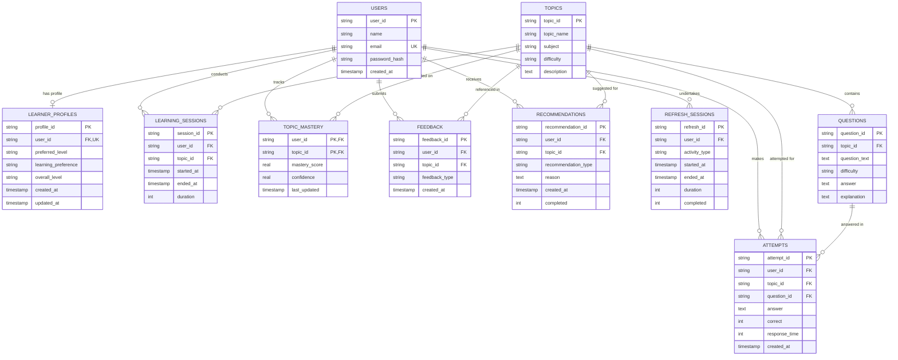

# ConceptBridge AI - Database Layer

> **ConceptBridge AI**: *From "I don't understand" to "Oh, it's that easy!"*

This directory houses the complete, centralized database design and database-access layer for **ConceptBridge AI**. It completely abstracts SQL interactions so that AI developers, UI engineers, and backend services can interact with clean, type-safe Python helper functions without writing raw SQL.

---

## Table of Contents
1. [Architecture & Design Principles](#architecture--design-principles)
2. [Database Schema & Relationships](#database-schema--relationships)
   - [Entity-Relationship Diagram](#entity-relationship-diagram)
   - [Tables & Field Specifications](#tables--field-specifications)
3. [Security Architecture](#security-architecture)
4. [Python Data Access API](#python-data-access-api)
   - [User Management](#user-management)
   - [Learner Profiles](#learner-profiles)
   - [Topics & Catalog](#topics--catalog)
   - [Questions & Checkpoints](#questions--checkpoints)
   - [Learning Sessions](#learning-sessions)
   - [Attempts & Metrics](#attempts--metrics)
   - [Topic Mastery](#topic-mastery)
   - [Feedback](#feedback)
   - [Recommendations](#recommendations)
   - [Smart Refresh Sessions](#smart-refresh-sessions)
   - [Aggregated Learning History](#aggregated-learning-history)
5. [Developer Usage Guides](#developer-usage-guides)
   - [For AI Developers](#for-ai-developers)
   - [For UI Developers](#for-ui-developers)
6. [Setup & Initialization](#setup--initialization)
7. [Seeding Development Data](#seeding-development-data)
8. [Running Tests](#running-tests)
9. [MySQL Migration Guide](#mysql-migration-guide)
10. [Assumptions & Design Choices](#assumptions--design-choices)

---

## Architecture & Design Principles

```
database/
├── __init__.py      # Clean public API exports
├── config.py        # Environment & dialect configuration
├── db.py            # Connection management, transaction context managers, DDL runner
├── models.py        # Typed dataclasses representing domain entities
├── queries.py       # Parameterized SQL repository functions
├── schema.sql       # Normalized DDL schema & performance indexes
├── security.py      # PBKDF2-HMAC-SHA256 salted password hashing & verification
├── seed.py          # Development seeder with realistic CS & AI topics
└── README.md        # Comprehensive documentation
```

### Core Design Rules:
1. **Zero SQL Leakage**: AI and UI developers interact purely through Python functions (`get_topic_mastery(user_id)`, `get_learner_profile(user_id)`).
2. **Normalized & Constraint-Enforced**: Foreign keys with `ON DELETE CASCADE` or `RESTRICT`, `CHECK` constraints on durations, scores, and enum values.
3. **Security First**: 
   - No plaintext passwords (salted PBKDF2 with 100,000 iterations).
   - 100% Parameterized queries preventing SQL injection.
   - Zero hardcoded secrets or API keys.
4. **Dialect Portability**: Developed on SQLite for zero-config local development, structured with standard ANSI SQL and connection abstractions for seamless MySQL migration.

---

## Database Schema & Relationships

### Entity-Relationship Diagram



---

### Tables & Field Specifications

| Table | Primary Key | Foreign Keys | Key Constraints | Purpose |
|---|---|---|---|---|
| **`users`** | `user_id` | - | `email` UNIQUE, NOT NULL | Account credentials & metadata |
| **`learner_profiles`** | `profile_id` | `user_id` -> `users.user_id` | `user_id` UNIQUE (1:1) | Pedagogical & pacing preferences |
| **`topics`** | `topic_id` | - | `topic_name` NOT NULL | Educational concept catalog |
| **`questions`** | `question_id` | `topic_id` -> `topics.topic_id` | `ON DELETE CASCADE` | Assessment questions & explanations |
| **`learning_sessions`** | `session_id` | `user_id`, `topic_id` | `duration >= 0` | Active study sessions & durations |
| **`attempts`** | `attempt_id` | `user_id`, `topic_id`, `question_id` | `correct IN (0, 1)`, `response_time >= 0` | Question interaction & response times |
| **`topic_mastery`** | `(user_id, topic_id)` | `user_id`, `topic_id` | `0.0 <= score, confidence <= 1.0` | Continuous skill tracking |
| **`feedback`** | `feedback_id` | `user_id`, `topic_id` | `type IN ('got_it', 'almost', 'still_confused')` | Subjective user comprehension |
| **`recommendations`** | `recommendation_id` | `user_id`, `topic_id` | `completed IN (0, 1)` | Adaptive AI next actions |
| **`refresh_sessions`** | `refresh_id` | `user_id` | `duration >= 0`, `completed IN (0, 1)` | Spaced repetition / Smart Refresh |

---

## Security Architecture

1. **Password Hashing**: Implemented via PBKDF2-HMAC-SHA256 with 100,000 rounds and a 16-byte cryptographically secure random salt generated via `secrets.token_bytes(16)`.
2. **Timing Attack Protection**: Constant-time verification using `hmac.compare_digest`.
3. **No Sensitive Leaks**: `User.to_dict()` strips `password_hash` by default unless explicitly requested internally for verification.
4. **SQL Injection Defense**: All database operations exclusively use parameterized SQL bindings (`?` or `%s`).

---

## Python Data Access API

All functions are exported directly from `database`:

```python
from database import (
    create_user,
    get_user,
    verify_user_credentials,
    get_learner_profile,
    update_learner_profile,
    create_topic,
    get_topic,
    list_topics,
    create_question,
    get_questions_by_topic,
    save_learning_session,
    save_attempt,
    get_attempts_by_user,
    get_topic_mastery,
    update_topic_mastery,
    save_feedback,
    get_feedback_by_user,
    save_recommendation,
    get_recommendations,
    mark_recommendation_completed,
    save_refresh_session,
    get_refresh_sessions_by_user,
    get_recent_learning_history,
)
```

---

## Developer Usage Guides

### For AI Developers

AI teaching agents can query a student's profile, calculate mastery, and log recommendations directly:

```python
from database import (
    get_learner_profile,
    get_topic_mastery,
    update_topic_mastery,
    save_recommendation,
)

# 1. Fetch user's learning style to tailor AI explanations
profile = get_learner_profile("usr_alex_001")
print(f"Adapting tone for: {profile.learning_preference} ({profile.preferred_level})")

# 2. Check mastery on a prerequisite topic
mastery = get_topic_mastery(user_id="usr_alex_001", topic_id="top_recursion")
if not mastery or mastery.mastery_score < 0.8:
    # 3. Post an automated AI recommendation
    save_recommendation(
        user_id="usr_alex_001",
        topic_id="top_recursion",
        recommendation_type="analogy_visual",
        reason="Mastery is below 80%. Review call stack visualization before moving forward.",
    )
```

---

### For UI Developers

UI components can render dashboards, profile screens, and record user actions effortlessly:

```python
from database import (
    get_user,
    get_learner_profile,
    get_recent_learning_history,
    save_feedback,
)

# 1. Fetch user dashboard summary
history = get_recent_learning_history("usr_alex_001")
print(f"Overall accuracy: {history['attempt_stats']['accuracy_percent']}%")
print(f"Comprehension feedback: {history['feedback_distribution']}")

# 2. When the user clicks the "I Got It!" button on the UI:
save_feedback(
    user_id="usr_alex_001",
    topic_id="top_recursion",
    feedback_type="got_it",
)
```

---

## Setup & Initialization

### Prerequisites
- Python 3.8+ (Standard library `sqlite3` included out of the box)

### Initialize Schema
Run database initialization from Python:

```python
from database import init_db

init_db()
print("Database schema successfully created!")
```

---

## Seeding Development Data

To populate the database with realistic sample topics (Recursion, Neural Backprop, B-Tree Indexing, Dynamic Programming), assessment questions, demo accounts, and session histories:

```bash
python -m database.seed
```

---

## Running Tests

Execute the test suite verifying all tables, security constraints, and query operations:

```bash
python run_tests.py
```

---

## MySQL Migration Guide

To transition from SQLite to MySQL:

1. Install `pymysql`:
   ```bash
   pip install pymysql
   ```
2. Create `.env` in the root directory:
   ```env
   DATABASE_TYPE=mysql
   DB_HOST=127.0.0.1
   DB_PORT=3306
   DB_USER=concept_user
   DB_PASSWORD=your_secure_password
   DB_NAME=conceptbridge_ai
   ```
3. Initialize the schema on MySQL:
   ```bash
   python -c "from database import init_db; init_db()"
   ```

---

## Assumptions & Design Choices

1. **UUID Primary Keys**: Textual UUID4 primary keys are used across entities to allow distributed ID generation and seamless scaling.
2. **Composite Primary Key on `topic_mastery`**: `(user_id, topic_id)` is a composite primary key with upsert logic (`ON CONFLICT DO UPDATE`), ensuring exactly one active mastery state per topic per user.
3. **Duration & Metric Constraints**: Validated at both the SQL schema level (`CHECK (duration IS NULL OR duration >= 0)`) and the Python function layer to prevent negative times.
4. **Decoupled Business Logic**: No application or AI prompt logic is coupled into the SQL queries, ensuring maximum architectural flexibility.
